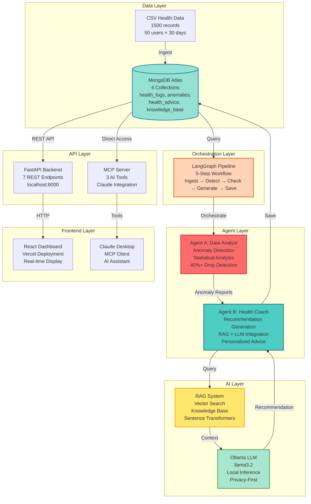

# Healthmov Insight Engine

> AI-Powered Multi-Agent System for Health Anomaly Detection and Personalized Recommendations

A production-ready health analytics platform that uses LangGraph orchestration, RAG (Retrieval-Augmented Generation), and local LLMs to detect health anomalies and generate personalized health coaching recommendations.

[](https://www.python.org/downloads/)
[](https://www.mongodb.com/cloud/atlas)
[](https://www.langchain.com/)
[](https://ollama.ai/)
[](https://fastapi.tiangolo.com/)
[](https://reactjs.org/)

---

## Overview

Healthmov Insight Engine analyzes 30 days of user health data (steps, sleep, heart rate) to detect significant anomalies (40%+ drops) and generates personalized AI-powered health recommendations using RAG and local LLM inference.

**Key Metrics:**
- 50 users with 1,500 total health records
- 5 anomalies detected (10% detection rate)
- 7-day baseline vs 3-day recent comparison
- Multi-metric monitoring: steps, sleep hours, heart rate

---

## System Architecture



### Pipeline Flow

**5-Step LangGraph Workflow:**

1. **Ingest Data** → Load CSV health data into MongoDB (1,500 records)
2. **Detect Anomalies** → Agent A analyzes 50 users, identifies 40%+ drops
3. **Check Anomalies** → Decision point: continue if anomalies found, else stop
4. **Generate Recommendations** → Agent B uses RAG + LLM for personalized advice
5. **Save Results** → Store recommendations in MongoDB for API/dashboard access

**Agent A Logic:**
- Calculate 7-day baseline average (days -10 to -4)
- Calculate 3-day recent average (days -3 to -1)
- Detect drops ≥40% (moderate) or ≥60% (severe)
- Output structured anomaly reports

**Agent B Logic:**
- Query RAG knowledge base with anomaly context
- Retrieve top 3 relevant health articles
- Generate personalized recommendation via Ollama LLM
- Sign as "Omar Tarek, Health Coach, Healthmov"

---

## Tech Stack

**Backend:** Python 3.11+, LangChain, LangGraph, FastAPI, Ollama (llama3.2), Sentence Transformers, FastMCP

**Database:** MongoDB Atlas (4 collections: health_logs, anomalies, health_advice, knowledge_base)

**Frontend:** React 18, Tailwind CSS, Vercel

**AI/ML:** Ollama llama3.2 (text generation), all-MiniLM-L6-v2 (embeddings), RAG

---

## Installation

### Prerequisites

- Python 3.11+
- MongoDB Atlas account
- Ollama installed locally
- Node.js 18+ (for frontend)

### Setup

```bash
# Clone repository
git clone https://github.com/omartariq22/health-insight-engine.git
cd health-insight-engine

# Create virtual environment
python -m venv venv
venv\Scripts\activate  # Windows
# source venv/bin/activate  # macOS/Linux

# Install dependencies
pip install -r requirements.txt

# Configure environment
# Create .env file with: MONGODB_URI=mongodb+srv://...

# Install Ollama and pull model
ollama pull llama3.2

# Initialize database
python database/setup.py
python rag/build_knowledge_base.py

# Install frontend dependencies
cd frontend-react
npm install
cd ..
```

---

## Usage

### Run Complete Pipeline

```bash
python pipeline.py
```

**Output:**
```
======================================================================
HEALTHMOV INSIGHT ENGINE - MULTI-AGENT PIPELINE
======================================================================

STEP 1: INGESTING DATA
✓ Data ingestion complete: 50 users loaded

STEP 2: DETECTING ANOMALIES (AGENT A)
✓ Agent A complete: 5 anomalies detected

STEP 3: CHECKING ANOMALIES
✓ 5 anomalies found - continuing to Agent B

STEP 4: GENERATING RECOMMENDATIONS (AGENT B)
✓ Agent B complete: 5 recommendations generated

STEP 5: VERIFYING RESULTS
✓ Verified: 5 recommendations in MongoDB

======================================================================
Status: COMPLETE
Total Users: 50
Anomalies Detected: 5
Recommendations Generated: 5
Execution Time: 86.49s
======================================================================
```

### Start API Server

```bash
cd backend
uvicorn main:app --reload --host 0.0.0.0 --port 8000
```

API available at: `http://localhost:8000`

### Start React Dashboard

```bash
cd frontend-react
npm start
```

Dashboard opens at: `http://localhost:3000`

---

## MCP Integration

### Available Tools

The MCP server exposes 3 tools for AI assistants like Claude Desktop:

1. **`analyze_user(user_id)`** - Run full pipeline for a single user
2. **`get_user_recommendation(user_id)`** - Retrieve existing recommendation
3. **`list_users_with_anomalies()`** - List all users with detected anomalies

### Configure Claude Desktop

Edit `%APPDATA%\Claude\claude_desktop_config.json`:

```json
{
  "mcpServers": {
    "healthmov": {
      "command": "C:\\path\\to\\health-insight-engine\\venv\\Scripts\\fastmcp.exe",
      "args": ["run", "C:\\path\\to\\health-insight-engine\\mcp_server.py"]
    }
  }
}
```

Restart Claude Desktop and ask:
- "Show me all users with health anomalies"
- "Analyze user 5 for health issues"
- "Get the recommendation for user 12"

---

## API Endpoints

**Base URL:** `http://localhost:8000`

| Method | Endpoint | Description |
|--------|----------|-------------|
| GET | `/` | Health check and API info |
| GET | `/anomalies` | Get all detected anomalies |
| GET | `/recommendations/{user_id}` | Get user recommendation |
| GET | `/recommendations` | Get all recommendations |
| GET | `/users/{user_id}/health` | Get user health data |
| POST | `/run-pipeline` | Trigger pipeline execution |
| GET | `/pipeline-status` | Get pipeline status |
| GET | `/stats` | Get system statistics |

---

## Project Structure

```
health-insight-engine/
├── agents/                  # Multi-agent system
│   ├── agent_a.py          # Anomaly detection
│   ├── agent_b.py          # Recommendation generation
│   └── models.py           # Data models
├── backend/                # FastAPI REST API
│   └── main.py            # 7 endpoints
├── data/                   # Data management
│   ├── health_logs.csv    # 1,500 health records
│   └── ingest.py          # MongoDB ingestion
├── database/               # Database utilities
│   ├── connection.py      # MongoDB connection
│   └── logger.py          # Logging system
├── frontend-react/         # React dashboard
│   └── src/               # UI components
├── rag/                    # RAG system
│   └── build_knowledge_base.py
├── pipeline.py             # LangGraph orchestration
├── mcp_server.py          # MCP server (3 tools)
└── requirements.txt        # Python dependencies
```

---

## Dashboard

**Live Demo:** https://health-insight-engine.vercel.app

**Features:**
- Anomaly cards with severity indicators
- Real-time statistics (total users, severe/moderate anomalies)
- Recommendation modal with RAG sources
- One-click pipeline execution
- Responsive mobile-friendly design

**Note:** Backend must be running locally at `http://localhost:8000`

---

## Contributing

Contributions welcome! Please:

1. Fork the repository
2. Create a feature branch (`git checkout -b feature/amazing-feature`)
3. Commit changes (`git commit -m 'Add amazing feature'`)
4. Push to branch (`git push origin feature/amazing-feature`)
5. Open a Pull Request

---

## License

This project is licensed under the MIT License.

---

## Author

**Omar Tarek**
- GitHub: [@omartariq22](https://github.com/omartariq22)
- Project: [health-insight-engine](https://github.com/omartariq22/health-insight-engine)

---

## Acknowledgments

- LangChain for agent orchestration framework
- Ollama for local LLM inference
- MongoDB Atlas for cloud database
- Anthropic for Claude Desktop MCP integration
- Vercel for frontend hosting

---

<div align="center">

**Built with LangGraph, RAG, and Local LLMs**

Star this repo if you find it helpful!

</div>
